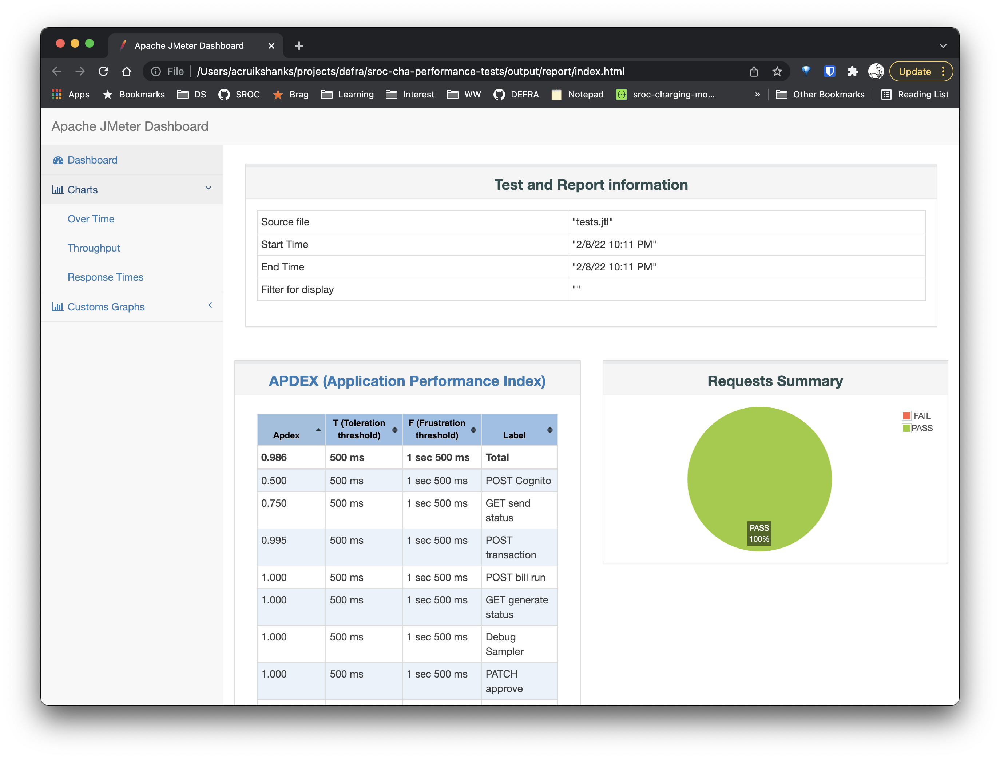

# Docker

> If you are new to Docker we suggest reading the [overview](https://docs.docker.com/get-started/overview/), with special attention to [Docker objects (Images & Containers)](https://docs.docker.com/get-started/overview/#docker-objects).

> Docker only helps with running the tests. To make changes to [tests.jmx](/tests.jmx) you'll still need JMeter running locally.

This project supports building a Docker image that allows users to skip installing and configuring JMeter directly in order to run the test plan. Instead we build an [executable image](https://www.infoq.com/articles/docker-executable-images/). The Docker image contains JMeter and the plugins needed and our test plan [tests.jmx](/tests.jmx). If used with the default command it also handles running the tests and generating the results.

This folder contains files needed during the build process and this README.

## Pre-requisites

To both build the image and run it you'll need [Docker](https://docs.docker.com/get-started/#download-and-install-docker). That's it!

## Build the image

If you are a [VSCode](https://code.visualstudio.com/) user you can use the [Command palette](https://code.visualstudio.com/docs/getstarted/userinterface#_command-palette) to access the tasks we have provided in [tasks.json](.vscode/tasks.json).

With the palette open search for **Run test task** and once highlighted select it. From the list that's presented select **🚧 BUILD (CMA-PERF)**

You should see a new terminal open up and [Docker build](https://docs.docker.com/engine/reference/commandline/build/) the image.

### Non-vscode users

You'll need to open a terminal at the root of the project and run `docker build -t sroc-cha-performance-tests:latest .`

## Running the tests

The [VSCode tasks](/.vscode/tasks.json) include a **✅ RUN** task for each Charging Module environment. They rely on you having created each [environment .env file](https://github.com/DEFRA/sroc-cha-performance-tests#configuration) first.

To run the tests against an environment use the command palette and the **Run test task** option and then select the relevant **✅ RUN** task.

### Local environment

The one exception to this is if you want to test a locally running instance of the [Charging Module API](https://github.com/DEFRA/sroc-charging-module-api). You'll need to set a different address for `CMS_BASE_URL` as `localhost` won't work. Copy your existing `environment/.local.env` as `environment/.docker.env` and then set `CMS_BASE_URL` to `host.docker.internal`.

> [How to Connect to Localhost Within a Docker Container](https://www.cloudsavvyit.com/14114/how-to-connect-to-localhost-within-a-docker-container/) was the source for this. It contains alternative approaches but this was the simplest for Mac & Windows users. Should you be a Linux user you'll need to specify the `--add-host` flag to the `docker run` call. This means non-of the VSCode tasks will work for you. Contact the [SROC service team](https://github.com/DEFRA/sroc-service-team) if this is causing you problems.

### Non-vscode users

If you wanted to run the tests against **DEV**, for example, you'll need to open a terminal at the root of the project and run

```bash
  docker run --rm --env-file environments/.dev.env -v `pwd`/output:/opt/output sroc-cha-performance-tests:latest
```

Amend the `--env-file` argument to match the environment you wish to use.

## Viewing the results

When the tests are running the JMeter log will be output to the console. You can also find a copy of it in `output/`. This folder will get created when you first run the tests using the Docker image and overwritten on subsequent runs.

In the folder you will find

- `jmeter.log` a copy of the output you'll see in the console. Generally, you only need to access this in event of unexpected errors
- `tests.jtl` actually a CSV file containing data on every request made during the tests
- `report/index.html` a generated HTML report of the test data. It contains various charts and stats that help with assessing the performance of the Charging Module API


